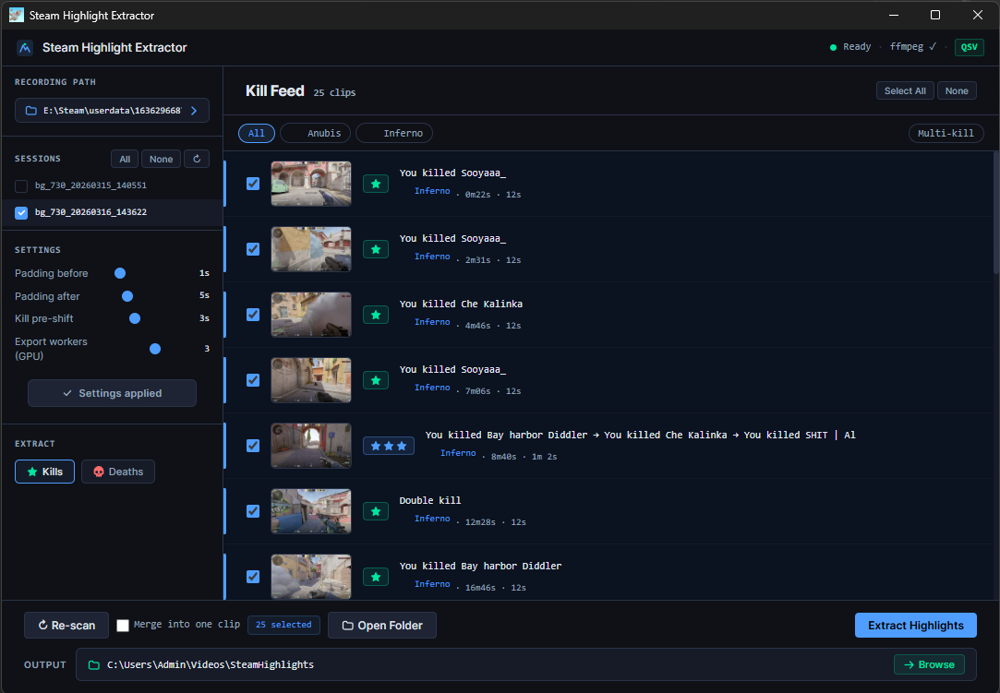

# Steam Highlight Extractor

Automatically extracts kill highlights and game moments from Steam's background recording into individual MP4 clips — no manual clipping needed.

It reads the timeline data Steam already records alongside your gameplay, finds the interesting moments (kills, multi-kills, deaths, etc.), and exports each one as a trimmed video clip.

---

## Quick Start

1. **Download** `SteamHighlightExtractor_2.2.0_x64-setup.exe` from the [Releases](../../releases) page and install it
2. **Enable Steam Background Recording**
   Steam → Settings → Game Recording → turn on Background Recording
3. **Launch** `Steam Highlight Extractor` from the Start Menu

No Python installation required. No ffmpeg installation required — it's bundled.

---

## Screenshot



---

## How to use

The app auto-detects your Steam recording folder on launch and scans the most recent session automatically.

1. **Select sessions** from the sidebar — add or remove sessions without re-scanning ones you've already loaded
2. **Review highlights** in the kill feed — each row shows a thumbnail preview, kill type badge, clip name, and duration
3. **Preview clips** with the play button on any row — watch the raw DASH recording before exporting, with kill event markers shown on the timeline
4. **Trim clips** inside the preview player — use the Start/End sliders to adjust clip boundaries, then click **✓ Apply** to save; trimmed rows get a **TRIMMED** badge
5. **Check the clips** you want to export (all are selected by default)
6. Set your **output folder** and toggle **Merge** if you want a single combined file
7. Click **▶ Export Selected** — per-clip progress cards show encoding status in real time
8. Click **📂 Open Output Folder** when done

Use **⏹ Stop** to cancel at any time. Already-exported clips are always skipped automatically, so re-running is safe.

---

## Settings

| Setting | Default | Description |
|---|---|---|
| Padding before | 10s | Lead-up time included before each event |
| Padding after | 5s | Time included after the last event in a clip |
| Kill pre-shift | 3s | Shifts kill clips earlier to capture the shot, not just the death animation |
| Merge window | 45s | Kills within this window are grouped into one multi-kill clip |
| Kills | ✅ | Extract kill events |
| Deaths | ☐ | Extract death events |
| Merge into one file | ☐ | Concatenate all exported clips into a single MP4 |

---

## Requirements

- **Windows 10/11 x64**
- **Steam Background Recording enabled**

ffmpeg is bundled — no separate installation needed.

---

## Running from source

**Prerequisites:** Python 3.9+, Node.js 18+, Rust toolchain

```bash
# 1. Start the backend
python server.py

# 2. In a second terminal, start the Tauri dev window
cd frontend
npx tauri dev
```

For dev mode you'll need `ffmpeg.exe` in the project root (it's bundled into the release build via PyInstaller but loaded from disk in dev).

---

## Building from source

```bash
# 1. Place ffmpeg.exe in the project root (required for PyInstaller bundling)

# 2. Bundle the Python backend as a sidecar executable
pip install pyinstaller
pyinstaller server.spec --noconfirm

# 3. Copy the sidecar into the Tauri binaries folder
copy dist\server.exe frontend\src-tauri\binaries\server-x86_64-pc-windows-msvc.exe

# 4. Re-enable the sidecar in tauri.conf.json:
#    "externalBin": ["binaries/server"]

# 5. Build the Tauri installer
cd frontend
npx tauri build
```

Output: `frontend/src-tauri/target/release/bundle/`

Or just run `build_tauri.bat` which does all of the above (and checks for `ffmpeg.exe` upfront).

---

## How it works

Steam's background recording saves a rolling buffer of your gameplay as MPEG-DASH chunks (`.m4s` files) alongside a `timeline_*.json` that logs in-game events with timestamps.

This tool:
1. Reads the timeline JSON to find kill/highlight events
2. Calculates which recording chunks cover each event, accounting for circular buffer rollover
3. Extracts a thumbnail frame from the clip midpoint during the scan phase
4. Serves the raw DASH stream to the in-app preview player so you can watch before exporting
5. Concatenates the relevant chunks and uses ffmpeg to trim and encode each clip

GPU-accelerated encoding is used automatically when available (NVIDIA NVENC, AMD AMF, or Intel Quick Sync). Falls back to software libx264 if no GPU encoder is detected.

No screen capture, no AI analysis — it uses the data Steam already collected.

---

## Output

Clips are saved as `.mp4` files encoded in H.264/AAC, ready to share or edit. Multi-kill clips are labelled with the kill count (e.g. `_3k_`, `_ace_`).

---

## Supported games

Currently tested with **Counter-Strike 2 (CS2)**. Any game that writes events to Steam's timeline JSON should work, but kill/death detection relies on CS2's event format.

---

## Troubleshooting

**No sessions found**
- Make sure Background Recording is enabled in Steam settings
- Try manually browsing to your gamerecordings folder:
  `C:\Program Files (x86)\Steam\userdata\<your-steam-id>\gamerecordings`

**Clips are empty or very short**
- The event may be outside the recording buffer window. Steam only keeps the last ~2 hours by default. Events from earlier in a long session won't have footage.

**Wrong moment captured**
- Increase the **Kill pre-shift** setting. CS2 logs kill events at death confirmation, which is 1–3 seconds after the shot lands.
- Use the in-app preview player to check the clip, then trim it with the Start/End sliders before exporting.

**Thumbnails not showing**
- This is normal for events near the edge of the recording buffer — the chunk needed for the thumbnail may have been overwritten. The clip itself may still export fine.

**Preview player won't load**
- Make sure the session path is accessible. The backend streams DASH segments directly from your Steam gamerecordings folder.

---

## Files

| File | Purpose |
|---|---|
| `steam_highlight_extractor.py` | Core clip logic — parse, scan, encode, merge |
| `server.py` | FastAPI backend, serves the Tauri frontend over HTTP + SSE |
| `frontend/` | Tauri v2 + Svelte 4 desktop app |
| `server.spec` | PyInstaller spec for bundling the backend sidecar (includes ffmpeg) |
| `build_tauri.bat` | One-click production build script |
| `gui.py` | Legacy CustomTkinter UI (kept for reference) |
